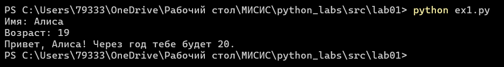
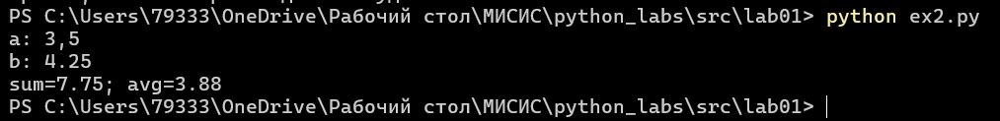
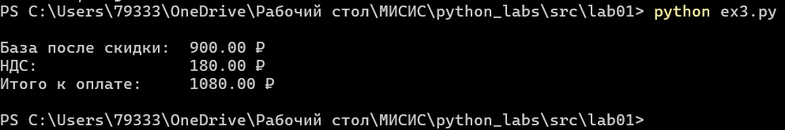
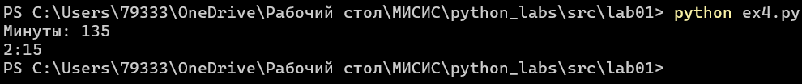
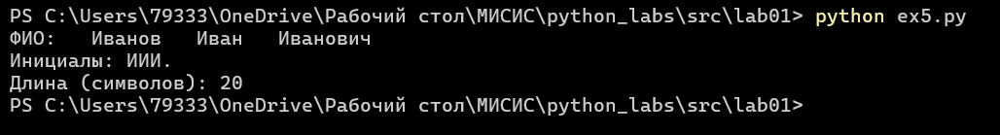
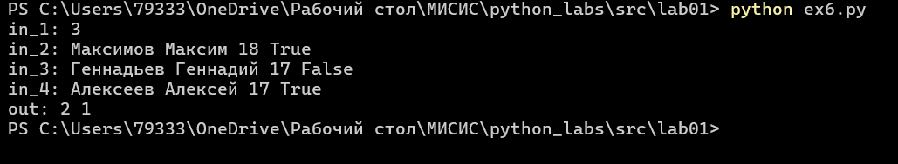
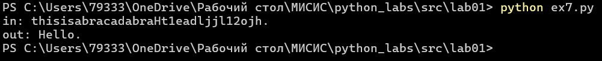

# Лабораторная работа 1
## Задание 1
|  |
| :--: |
| Рис 1. Работа программы первого задания |
## Задание 2
|  |
| :--: |
| Рис 2. Работа программы суммы и среднего |
## Задание 3
|  |
| :--: |
| Рис 3. Программа, выводящая чек |
## Задание 4
|  |
| :--: |
| Рис 4. Работа программы перевода минут в формат ЧЧ:ММ |
## Задание 5
|  |
| :--: |
| Рис 5. Программа, выводящая инициалы и длинну чистого ФИО |
## Задание 6
В начале получаем количество данных, далее создаем отдельный итератор и счетчик очных участников. Считываем поочередно данныые, если введена строка, заканчивающаяся на True, то прибавляем к счетчику 1. На экран выводим счетчик очных участников и количество заочных, как `количество данных - 2 - количество очных`.

Протестируем работу программы на уменьшеном массиве данных.
|  |
| :--: |
| Рис 6. Программа находит число очных и заочных участников |
## Задание 7
- Получаем ввод строки.
- Вводим буфер, накапливающий дешифрованную строку
- Создаем указание на состояния
- Создаем переменную с номером первого символа
- Создаем перменную шага
- Проходимся циклом по исходной строке
	- Если состояние 0 и код символа в диапазоне `[65; 90]`, то:
		- Кидаем символ в буфер
		- Фиксируем номер первого элемента
		- Состояния = 1
	- Иначе, если состояние = 1 И символ - цифра, т.е содержится в `0123456789`, то:
		- Находим шаг как разность текущего индекса символа и переменной с нмоером первого символа
		- Прервать цикл
- Разделяем символ по `.` берем только левую часть, далее берем срез: `[номер первого + шаг + 1]`
- Проходимся по полученой строке с **шагом** и добавляем в буфер символы
- Выводим буфер, добавляя точку в конце.

|  |
| :--: |
| Рис 7. Работа дешифровки |