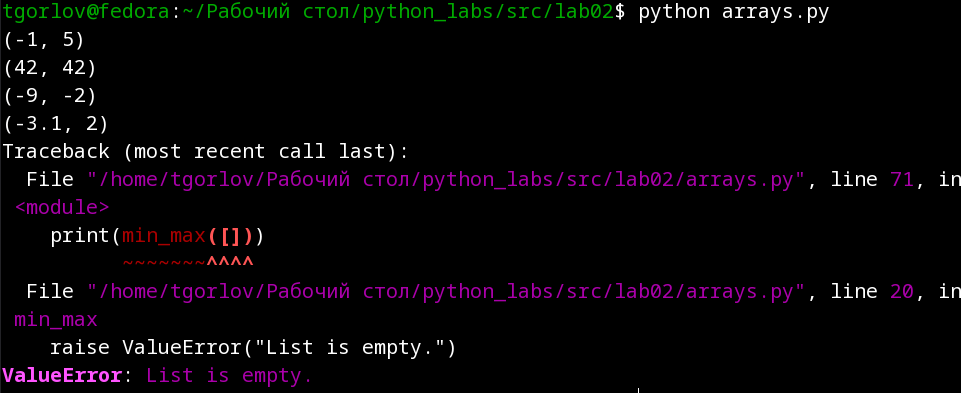
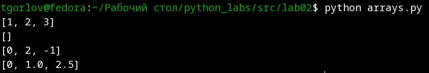
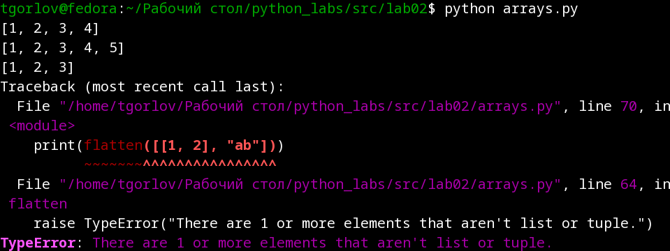
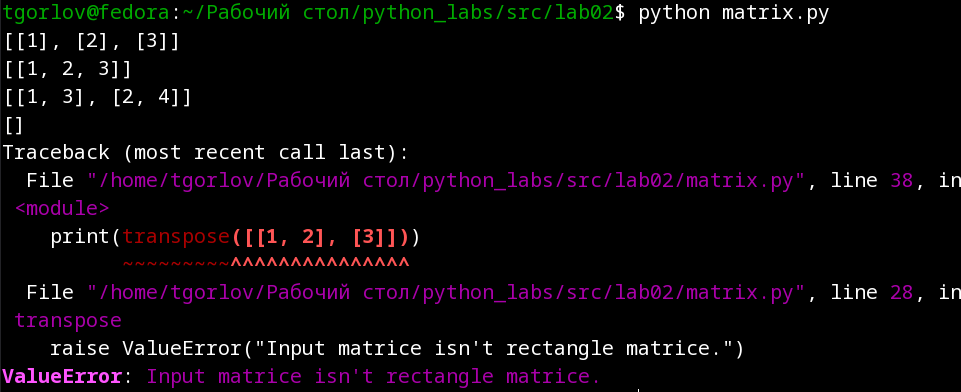
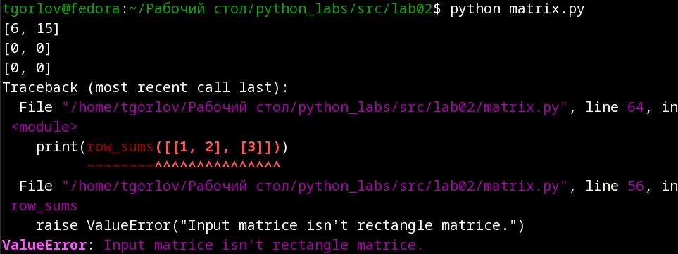
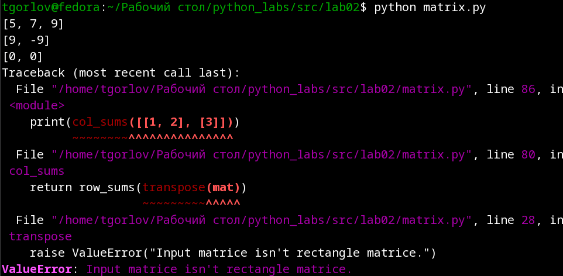
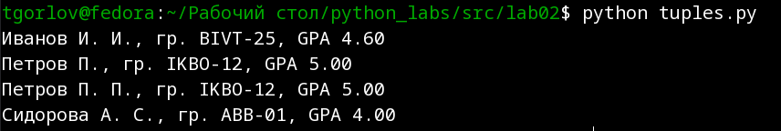

# Лабораторная работа 2
## Задание 1. Массивы.
## функция min_max
Для реализации просто берем `min()` и `max()` по списку и упаковываем в кортеж.
```py
def min_max(nums: list[float | int]) -> tuple[float | int, float | int]:
    """
    This function takes list and return pair (min, max) of the list.

    Input data
    -----------
    nums: list [float or int]

    Returns
    -------
    Pair (min, max)
        Type: tuple [float | int, float | int]

    Raises
    ------
    ValueError: List is empty.
    """

    if len(nums) == 0:
        raise ValueError("List is empty.")
    return (min(nums), max(nums))

# Test-cases
print(min_max([3, -1, 5, 5, 0]))
print(min_max([42]))
print(min_max([-5, -2, -9]))
print(min_max([1.5, 2, 2.0, -3.1]))
print(min_max([]))
```
|  |
| :--: |
| Рис 1. Работа функции min_max из первого задания |

### Функция unique_sorted
Функция преобразования в `set()` удалит повторы и сделает порядок по возрастанию. После чего преобразуем обратно в список.
```py
def unique_sorted(nums: list[float | int]) -> list[float | int]:
    """
    It takes list and return ascending sorted list with only unique values.

    Input data
    ----------
    nums: list [float | int]

    Returns
    -------
    Ascending sorted list with only unique values.
        Type: list [float | int]
    """

    return list(set(nums))

# Test-cases
print(unique_sorted([3, 1, 2, 1, 3]))
print(unique_sorted([]))
print(unique_sorted([-1, -1, 0, 2, 2]))
print(unique_sorted([1.0, 1, 2.5, 2.5, 0]))
```
|  |
| :--: |
| Рис 2. Работа функции unique_sorted из первого задания |

### Функция flatten
Поочередно распаковываем кортежи (или списки преобразованные в кортежи), добавляя в общий накопительный буфер.
```py
def flatten(mat: list[list | tuple]) -> list:
    """
    It takes list with lists or tuples and flatten its at common list.

    Input data
    ----------
    mat: list [list | tuple]

    Returns
    -------
    Flatten list.
        Type: list

    Raises
    ------
    TypeError: Unexpected 1 or more elements that aren't list or tuple.
    """

    buf = []
    for m in mat:
        if type(m) == list or type(m) == tuple:
            buf += [*tuple(m)]
        else:
            raise TypeError("There are 1 or more elements that aren't list or tuple.")
    return buf

# Test-cases
print(flatten([[1, 2], [3, 4]]))
print(flatten([[1, 2], (3, 4, 5)]))
print(flatten([[1], [], [2, 3]]))
print(flatten([[1, 2], "ab"]))
```
|  |
| :--: |
| Рис 3. Работа функции flatten из первого задания |

## Задание 2. Матрицы.
### Функция transpose
Изначально создаем новый список мест для новых значений, который уже является транспанированым (не учитывая сами значения). Далее заполняем новый список значениями, меняя местами у элементов параметр **строки** и **столбца**.
```py
def transpose(mat: list[list[float | int]]) ->  list:
    """
    This function transposes rectangly matrice.

    Input data
    ----------
    mat: list [ list [float | int] ]
        Matrice.
    Returns
    -------
    Transposed matrice.
        Type: list[list]

    Raises
    ------
    ValueError: Matrice isn't rectangly.
    """

    if len(mat) == 0:
        return []
    else:
        m = len(mat)
        n = len(mat[0])
        new_mat: list[list[float | int]] = [[0 for _ in range(m)] for _ in range(n)]
        first_row = len(mat[0])
        for i in range(m):
            if len(mat[i]) != first_row:
                raise ValueError("Input matrice isn't rectangle matrice.")
            for j in range(n):
                new_mat[j][i] = mat[i][j]
        return new_mat

# Test-cases
print(transpose([[1, 2, 3]]))
print(transpose([[1], [2], [3]]))
print(transpose([[1, 2], [3, 4]]))
print(transpose([]))
print(transpose([[1, 2], [3]]))
```
|  |
| :--: |
| Рис 4. Работа функции transpose из второго задания |

### Функция row_sums
В начале проверяем прямоугольность матрицы. Далее итерируем по массиву и для каждой строки находим сумму, тут же записываем эти данные в новый список. Этот список возвращаем.
```py
def row_sums(mat: list[list[float | int]]) -> list[float]:
    """
    This function takes matrice and returns list of sums by rows.

    Input data
    ----------
    mat: list[ list [float | int] ]
        Matrice.

    Returns
    -------
    List of sums by rows.
        Type: list[float]

    Raises
    ------
    ValueError: Input matrice isn't rectangle matrice.
    """

    # Check input matrice if it's rectangly.
    for r in mat:
        if len(r) != len(mat[0]):
            raise ValueError("Input matrice isn't rectangle matrice.")

    return [sum(mat[i]) for i in range(len(mat)) if len(mat[i]) == len(mat[0])]

# Test-cases
print(row_sums([[1, 2, 3], [4, 5, 6]]))
print(row_sums([[-1, 1], [10, -10]]))
print(row_sums([[0, 0], [0, 0]]))
print(row_sums([[1, 2], [3]]))
```
|  |
| :--: |
| Рис 5. Работа функции sums из второго задания |

### Функция col_sums
Для упрощения задачи вопользуемся очевидным фактом: сумма значений в строке и столбце опредляется одинаково, из этого следует, что можно транспонировать исходную матрицу и найти суммы по строкам, которые явялются столбцами в исходной матрице.
```py
def col_sums(mat: list[list[float | int]]) -> list[float]:
    """
    This function takes matrice and returns list of sums by collums.

    Input data
    ----------
    mat: list[ list [float | int] ]
        Matrice.

    Returns
    -------
    List of sums by collums.
        Type: list[float]

    Raises
    ------
    ValueError: Input matrice isn't rectangle matrice.
    """

    return row_sums(transpose(mat))

# Test-cases
print(col_sums([[1, 2, 3], [4, 5, 6]]))
print(col_sums([[-1, 1], [10, -10]]))
print(col_sums([[0, 0], [0, 0]]))
print(col_sums([[1, 2], [3]]))
```
|  |
| :--: |
| Рис 6. Работа функции col_sums из второго задания |

## Задание 3. Кортежи.
1. Распакуем кортеж;
2. Удалим все лишние пробелы внутри строки ФИО;
3. Удалим пробелы по концам строки ФИО;
4. Проверим ФИО, группу и GPA на соответствие требованиям;
5. Разобъем ФИО по пробелам;
6. Соберем инициалы в правильном формате с помощью f-строк;
7. Вернем f-строку, содержащую инициалы, группу и GPA с двумя знаками после точки.

```py
def format_record(rec: tuple[str, str, float]) -> str:
    """
    It is format record (fio, griup, gpa) to string by rules.

    Inpurt data
    -----------
    rec: tuple[str, str, float]

    Returns
    -------
    Formated string from tuple.
        Type: str.
        Format examples: "Сидорова А.С., гр. ABB-01, GPA 4.00", "Петров П.;
                        гр. IKBO-12, GPA 5.00".

    Raises
    ------
    ValueError: Incorrect fio.
        When fio is empty.
    ValueError: Incorrect group.
        When group is empty.
    TypeError: Incorrect type for GPA.
        When type of GPA isn't float.
    """

    fio, group, gpa = rec
    while "  " in fio: fio = fio.replace("  ", " ")
    fio = fio.strip()

    if fio == "": raise ValueError("Incorrect fio.")
    if group == "": raise ValueError("Incorrect group.")
    if type(gpa) != float: raise TypeError("Incorrect type for GPA.")

    fio_spl = fio.split()
    inicialy = f"{fio_spl[0][0].upper()}{fio_spl[0][1::]} {fio_spl[1][0].upper()}. {fio_spl[2][0].upper()}."\
        if len(fio_spl) == 3 \
        else f"{fio_spl[0][0].upper()}{fio_spl[0][1::]} {fio_spl[1][0].upper()}."
    return f"{inicialy}, гр. {group}, GPA {gpa:.2f}"

# Test-cases
print(format_record( ("Иванов Иван Иванович", "BIVT-25", 4.6) ))
print(format_record( ("Петров Пётр", "IKBO-12", 5.0) ))
print(format_record( ("Петров Пётр Петрович", "IKBO-12", 5.0) ))
print(format_record( ("  сидорова  анна   сергеевна ", "ABB-01", 3.999) ))
```
|  |
| :--: |
| Рис 7. Работа функции format_record из третьего задания |
