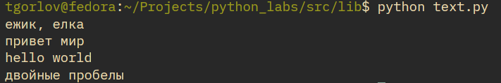
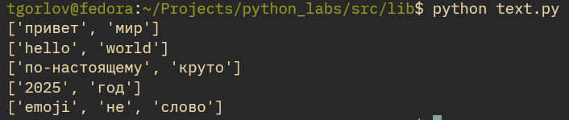
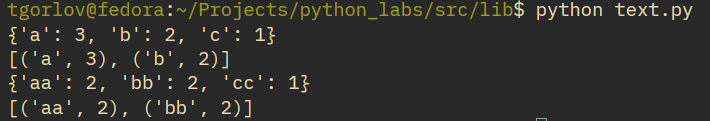
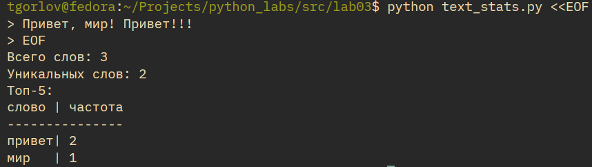
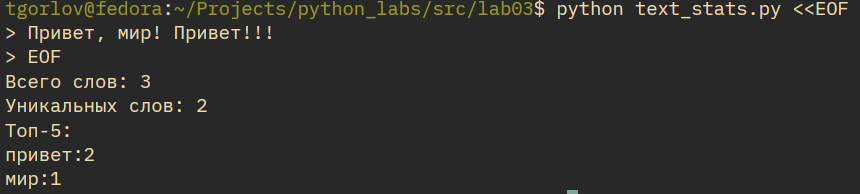

# Лабораторная работа 3
## Функции для работы с текстом
В начале файла `src/lib/text.py` обязательно импортируем `re` для работы с регулярными выражениями.
```py
import re
```
### Нормализация
```py
def normalize(text: str, *, casefold: bool = True, yo2e: bool = True) -> str:
    """
    This function normalizes input text.

    Input data
    -----------
    text: str,
    *
    casefold: bool = True
    yo2e: bool = True

    Returns
    -------
    Normalized text.
        Type: str

    Tests
    -----
    assert normalize("ПрИвЕт\nМИр\t") == "привет мир"
    assert normalize("ёжик, Ёлка") == "ежик, елка"
    """

    if casefold: text = text.casefold()
    if yo2e: text = text.replace("ё", "e").replace("Ё", "Е")
    text = text.replace("\t", " ").replace("\r", " ").replace("\n", " ")
    while "  " in text: text = text.replace("  ", " ")
    return text.strip()

print(normalize("ёжик, Ёлка"))
print(normalize("ПрИвЕт\nМИр\t"))
print(normalize("Hello\r\nWorld"))
print(normalize("  двойные   пробелы  "))
```

|  |
| :--: |
| Рис 1. Работа функции нормализации |

### Токенизация
```py
def tokenize(text: str) -> list [str]:
    """
    This function tokenizes input (normalized) text.

    Input data
    -----------
    text: str

    Returns
    -------
    List of tokens.
        Type: list [str]

    Tests
    -----
    assert tokenize("привет, мир!") == ["привет", "мир"]
    assert tokenize("по-настоящему круто") == ["по-настоящему", "круто"]
    assert tokenize("2025 год") == ["2025", "год"]
    """
    tokens = re.findall(r"\w+(?:-\w+)*", text)
    return tokens

print(tokenize("привет мир"))
print(tokenize("hello,world!!!"))
print(tokenize("по-настоящему круто"))
print(tokenize("2025 год"))
print(tokenize("emoji 😀 не слово"))
```

|  |
| :--: |
| Рис 2. Работа функции токенизации |

### Подсчет частотности слов
```py
def count_freq(tokens: list[str]) -> dict [str, int]:
    """
    It counts frequencies for tokens.

    Input data
    -----------
    tokens: list[str]

    Returns
    -------
    List of frequencies for tokens.
        Type: dict [str, int]

    Tests
    -----
    freq = count_freq(["a","b","a","c","b","a"])
    assert freq == {"a":3, "b":2, "c":1}
    """
    freqs = {}
    for t in sorted(tokens):
        c = tokens.count(t)
        freqs.update({t: c})
    return freqs
```
### Топ-n слов по частотности
```py
def top_n(freq: dict[str, int], n: int = 5) -> list [ tuple [str, int] ]:
    """
    It returns TOP-n of tokens by frequencies.

    Input data
    -----------
    freq: dict[str, int]
    n: int = 5

    Returns
    -------
    TOP-n.
        Type: list [ tuple [str, int] ]

    Tests
    -----
    1.
        freq = count_freq(["a","b","a","c","b","a"])
        assert freq == {"a":3, "b":2, "c":1}
        assert top_n(freq, 2) == [("a",3), ("b",2)]
    2.
        freq2 = count_freq(["bb","aa","bb","aa","cc"])
        assert top_n(freq2, 2) == [("aa",2), ("bb",2)]
    """
    items = [i for i in freq.items()]
    items.sort(key=lambda x: x[1], reverse=True)
    return items[:n]
```

### Тест-кейсы для count_freq и top_n
```py
print(count_freq(["a","b","a","c","b","a"]))
print(top_n( count_freq(["a","b","a","c","b","a"]), n=2 ))
print(count_freq(["bb","aa","bb","aa","cc"]))
print(top_n( count_freq(["bb","aa","bb","aa","cc"]), n=2 ))
```

|  |
| :--: |
| Рис 3. Работа функций count_freq и top_n |

## Второе задание
Для правильного импорта модулей из `lib` пропишем `path.insert(0, os.path.join(os.path.dirname(__file__), '..', '..'))`. Для работы этой строки требуется импорт `os` и `path` is `sys`.

Через флаг `TABLE_MODE` в коде можно выбрать табличное отображение или обыкновенное. Первая часть статистики общая, вне зависимости от выбранного режима отображения. Далее либо выводим ТОП-5 построчно или в виде таблицы.

```py
import os
from sys import path, stdin

path.insert(0, os.path.join(os.path.dirname(__file__), '..', '..'))

from src.lib.text import *

TABLE_MODE = True

text = stdin.read()
text_nrm = normalize(text)
tokens = tokenize(text_nrm)
freqs = count_freq(tokens)
top_5 = top_n(freqs, 5)

print(f"Всего слов: {len(tokens)}\nУникальных слов: {len(freqs.keys())}\nТоп-5:")

if TABLE_MODE:
    max_len = max(len(k) for k in freqs)

    print(f"{"слово":<{max_len}}| частота")
    print("-"*( max_len + 9 ))

    for item in top_5:
        w, f = item
        print(f"{w:<{max_len}}| {f}")
else:
    for item in top_5:
        w, f = item
        print(f"{w}:{f}")
```
**Ввод в программу**. Ввод осуществляем с чтением нескольких строк до `EOF`.
|  |
| :--: |
| Рис 4. Работа программы статистики по тексту с табличным выводом |

|  |
| :--: |
| Рис 5. Работа программы статистики по тексту с обыкновенным выводом |
