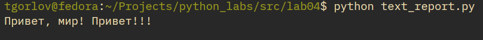
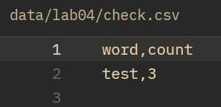

# Лабораторная работа 4
## Задание A
В начале файла `io_txt_csv.py` импортируем следующие библиотеки:
```py
import csv
from collections.abc import Iterable, Sequence
from pathlib import Path
```

### Функция read_text
```py
def read_text(path: str | Path, encoding: str = "utf-8") -> str:
    """
    It reads text from file with choosed encoding.

    Input data
    -----------
    path: str | Path
        Path to file.
    encoding = "utf-8": str
        Choosed encoding. You can choose another encoding, for example: encoding="cp1251".

    Returns
    -------
    Text from file.
        Type: str

    Exceptions
    ----------
    FileNotFoundError
    UnicodeDecodeError
    """
    p = Path(path)
    return p.read_text(encoding=encoding)
```

### Функция write_csv
```py
def write_csv(rows: Iterable[Sequence], path: str | Path,
    header: tuple[str, ...] | None = None) -> None:
    """
    It writes CSV-table with header and rows by path.

    Input data
    -----------
    rows: Iterable[Sequence]
    path: str | Path
        Path to file.
    header: tuple[str, ...] | None = None

    Returns
    -------
    None

    Exceptions
    ----------
    ValueError: rows must has similar length.
    """
    p = Path(path)
    rows = list(rows)
    with p.open("w", newline="", encoding="utf-8") as f:
        w = csv.writer(f)
        if header is not None:
            w.writerow(header)

        for r in range(len(rows)):
            if len(rows[r]) == len(rows[0]):
                w.writerow(rows[r])
            else:
                raise ValueError("rows must has similar length.")
```

### Функция ensure_parent_dir
```py
def ensure_parent_dir(path: str | Path) -> None:
    """
    Creates parent directory for file if it wasn't.

    Input data
    -----------
    path: str | Path
        Full path to file!

    Returns
    -------
    None
    """
    path = Path(path)
    parts = path.parts
    if not Path(*parts[:-1]).exists():
        Path(*parts[:-1]).mkdir()
        return
```

### Мини-тесты
```py
from io_txt_csv import read_text, write_csv

txt = read_text("../../data/lab04/input.txt")  # должен вернуть строку
print(txt)
write_csv([("word","count"),("test",3)], "../../data/lab04/check.csv")  # создаст CSV
```
|  |
| :--: |
| Рис 1. Мини-тесты read_text и write_csv |

|  |
| :--: |
| Рис 1. Содержимое check.csv |
